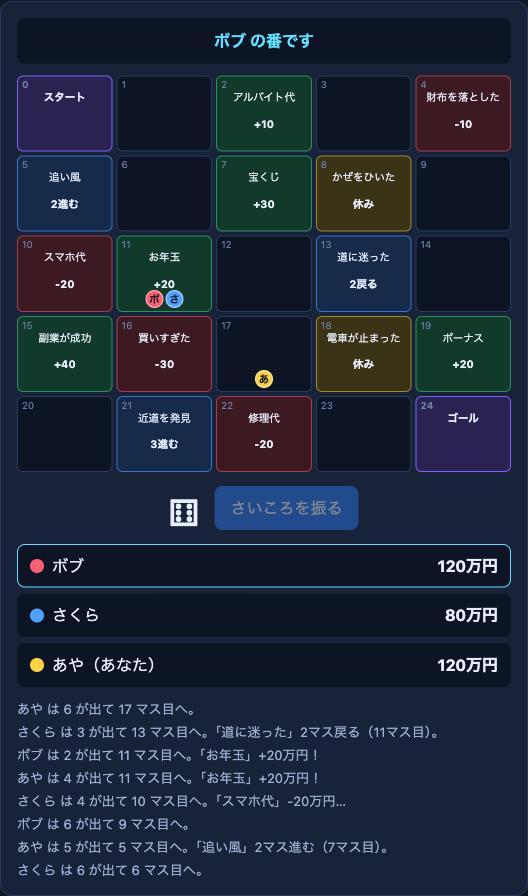

# Battle Base — 通信対戦ゲームの土台

スマホやパソコンで**部屋に集まって、みんなで遊ぶ対戦ゲーム**を作るための、ひな形です（授業用）。

最初から、**ミニ人生ゲーム**（ターン制・2〜6人）が動くサンプルが入っています。まずこれを遊んで、ルールやマスを書き換えて、自分たちのゲームにしていきます。



## この土台に入っているもの・入っていないもの

| | 内容 |
|---|---|
| **できあがっている** | 部屋を作る・部屋に入る／招待リンク／参加者の一覧／ホストが開始／**みんなの画面にデータを届ける通信** |
| **サンプルとして入っている** | ミニ人生ゲーム（盤面、さいころ、お金、イベントマス、ゴール、順位） |
| **自分たちで作る** | ゲームのルールと画面。**ファイルは `public/game.js` だけ**を書き換える |

## どんなゲームが作れる？

- **順番に遊ぶゲーム（ターン制）** … このサンプルがそうです。人生ゲーム、すごろく、カードゲーム、オセロなど。
  1人が操作したら、その内容を全員に送って、全員の画面で同じ計算をします。
- **同時に動くゲーム（リアルタイム）** … ボンバーマンなど。通信のしくみ（`ctx.send`）は同じものを使います。**サンプル2（ミニボンバーマン）が入っています**（下の「サンプル2」を見てください）。
  動きを送る回数が多くなるので、送る頻度には上限があります（1秒あたり100通まで）。ボンバーマンでは、ずれを防ぐため、1人が「審判」になるしくみを使います。

---

## 遊び方（Codespaces）

Cyber Tetris のときと同じ手順です。

1. このリポジトリを **Fork** する（右上の「Fork」→「Create fork」）。
2. Fork した自分のリポジトリで、**「Code」→「Codespaces」→「＋」**で Codespaces を作る。
3. 下のターミナルで、次を入力する。

   ```bash
   npm start
   ```

4. 下のパネルの**「ポート」タブ**に出る **8000番**を右クリック →**「ポートの表示範囲」→「Public」**にする（英語表示なら Port Visibility → Public）。
5. 8000番の行の**地球儀アイコン**（またはURL）で画面を開く。
   最初に、GitHub の**注意画面**（英語で「You are about to access a development port served by someone's codespace」）が出る。**自分たちのリンクなら、緑の「Continue」ボタンを押して進む。** この画面は最初の1回だけ出る。知らない人から届いたリンクでは押さない。
6. 名前を入れて**「部屋を作る」**。表示された**「招待リンクをコピー」**を、チームに送る。招待された人も、リンクを開くと最初に同じ注意画面が出るので、「Continue」を押して進む。
7. 2人以上そろったら、ホストが**「ゲームを始める」**を押す。

> `npm start` は、Codespaces を開き直すたびに必要です。終わったら、ポートの公開をやめて、Codespaces を停止します。
>
> サーバーの動き（部屋ができた・誰かが入った・ゲーム開始、遊んでいる間は1分ごとの中継数）は、`npm start` を動かしているターミナルに1行ずつ表示されます。Codespaces は、**キーボード・マウスの操作もターミナルの出力もない状態が30分（既定）続くと、止まります**（公式）。部屋の動きがターミナルに出ている間は、止まりにくくなりますが（URLを知っている人が操作を繰り返すと、止まりにくくなる点にも注意。Codespaces は、操作の有無にかかわらず、最大12時間で止まります。授業の最後には、必ず自分で停止します。また、30分間動きのない部屋（入室・開始・メッセージがない）は、サーバーが閉じます）、遊んでいる途中で止まったときは、Codespaces を再開して `npm start` をやり直します（部屋は消えるので、作り直します）。

### 1人でも確かめられる

ブラウザのタブを2つ開き、片方で部屋を作り、もう片方で招待リンクを開きます。2つ目のタブは、シークレットウィンドウにすると、別の人として入れます。

`public/` の中（`game.js` など）を変えたら、**ブラウザを再読み込みするだけ**で反映されます（再読み込みすると部屋から抜け、ゲームが始まった部屋には戻れないので、新しい部屋を作り直します）。`server.js` を変えたときだけ、`npm start` を止めて（`Ctrl+C`）、もう一度 `npm start` を実行します。

---

## サンプル（ミニ人生ゲーム）のルール

- 順番にさいころを振り、その目の数だけコマを進める。
- 止まったマスのイベントが起きる。**お金が増える（緑）／減る（赤）／1回休み（黄）／進む・戻る（青）**。
  「進む・戻る」マスで動いた先のマスでも、そのイベントが起きる（そこからさらに動くことはない）。
- ゴールすると、着順に応じたボーナスがもらえる（1着 +50万円、2着 +30万円、3着 +10万円）。
- 全員がゴールしたら終わり。**着順ではなく、お金がいちばん多い人の勝ち**。

## 改造してみよう

どれも、`public/game.js` の**上のほうを書き換えるだけ**です。

1. **`BOARD`** … マスを増やす・変える。`plus('宝くじ', 30)`（お金が増える）、`minus(...)`（減る）、`skip(...)`（1回休み）、`move(..., 3)`（3マス進む）が使える。
2. **`GOAL_BONUS`** … ゴールのボーナスの金額を変える。
3. **`START_MONEY`** … 最初のお金を変える。

その次の挑戦の例:
- 新しい種類のマス（例: 全員から10万円もらう、誰かとお金を交換する）を作る。
- 職業や結婚などのイベントを足して、人生ゲームらしくする。
- 盤面の見た目（`style.css`）を、自分たちのテーマに変える。

## サンプル2: ミニボンバーマン（リアルタイム）

**同時に動く**対戦ゲームのサンプルです（2〜6人）。ファイルは `public/bomber.js` です。
本物のボンバーマン（スーパーボンバーマンのバトルモード）のルールに合わせて作っています。

### 遊び方

- 普通のURLのかわりに、**URLの最後に `?game=bomber` を付けて開きます**。
  Codespaces なら、公開した8000番のURLの末尾に付けます（例: `https://○○-8000.app.github.dev/?game=bomber`）。
  付けないと、ミニ人生ゲームが動きます。
- 部屋を作って**「招待リンクをコピー」**すると、`?game=bomber` 付きのリンクがコピーされます。招待された人は、そのまま同じゲームに入れます。
- ホストが「ゲームを始める」を押すと、3・2・1・GO! のあとに始まります。
- 爆弾を置いて、ブロックを壊しながら進み、**爆風で相手をやっつけます。自分の爆風に当たってもやられます。**
  **最後の1人になったら勝ち**、全員いっしょにやられたら引き分けです。途中で部屋を抜けた人は、やられた扱いになります。

### 操作

| | 移動 | 爆弾 |
|---|---|---|
| パソコン | 矢印キー / `W` `A` `S` `D` | スペース |
| スマホ | 画面の方向パッド（指をすべらせると向きが変わる） | 画面の 💣 ボタン |

ゲームパッドには対応していません（**改造の挑戦テーマ**です。下の「改造してみよう」を見てください）。

### ルール: 本物のボンバーマンの決まりと、このサンプルの決まり

**本物のボンバーマンの決まり（公式の資料で確認したもの）**

- 爆弾は**3秒**で爆発する。爆風は**上下左右の十字**に広がる。
- 爆風に触れた爆弾は、すぐに爆発する（**誘爆**。次々に連鎖する）。
- バトルは**最後の1人が勝ち**。制限時間は**2分**。
- **1分たつとサドンデス**: 警告が出て、外側から**時計回りのらせん状に壁が落ちてくる**。壁が落ちた場所にいるとやられる。
- 壊せるブロックを壊すと、アイテムが出ることがある。このサンプルのアイテムは3種類: **ボム増加**（同時に置ける爆弾 +1）、**火力アップ**（爆風 +1マス）、**スピードアップ**。
- 盤面は奇数の大きさで、外周が壁。**「行も列も偶数」のマスに固定ブロック**が並ぶ市松模様なので、通路が必ずつながっている。

**このサンプルの決まり（公式の値ではないもの。`bomber.js` の先頭で【サンプルの決まり】と書いてある）**

| 項目 | 値 | 定数 |
|---|---|---|
| 盤面の大きさ | 15×13（外周の壁を含む。遊べるのは13×11） | `COLS` `ROWS` |
| 最初の爆風の長さ | 2マス | `RANGE` |
| 最初に同時に置ける爆弾 | 1個 | `START_BOMBS` |
| 爆風が残る時間 | 0.5秒 | `FIRE_MS` |
| 壊せるブロックの多さ | 空きマスの約70%（各スタートと、その隣の2マスは必ず空ける） | `SOFT_RATE` |
| アイテムが出る確率 | 35%（ボム増加35・火力アップ35・スピードアップ30 の割合） | `ITEM_RATE` `ITEM_WEIGHTS` |
| アイテムの上限 | 爆弾6個・爆風6マス・スピード+4段階 | `MAX_BOMBS` `MAX_RANGE` `MAX_SPEED_UP` |
| 歩く速さ | 1秒に4マス（スピードアップ1段階ごとに +0.6） | `SPEED` `SPEED_STEP` |
| 自分の爆弾から離れる | 置いた直後、その上にいる間は通れる。離れたら壁になる | （しくみ） |
| サドンデスの壁 | 警告の3秒後から、0.25秒に1マス。外側から4周ぶん落ちて、真ん中は残る | `SD_WARN_MS` `SD_WALL_MS` `SD_RINGS` |

時間切れ（2分）のときに2人以上が残っていたら、引き分けです。爆風に巻き込まれたアイテムは消えます。

出典（公式の決まりを確認したページ）:
- StrategyWiki「Super Bomberman/Gameplay」 https://strategywiki.org/wiki/Super_Bomberman/Gameplay
- StrategyWiki「Super Bomberman/Power-ups」 https://strategywiki.org/wiki/Super_Bomberman/Power-ups
- DEV Community「Building Bomberman from a Grid of Integers」（盤面の作り方） https://dev.to/dev48v/building-bomberman-from-a-grid-of-integers-a-2-second-fuse-a-cross-blast-raycast-and-bfs-hunters-3ac1
  （この記事のサンプルは導火線が2秒ですが、本物のボンバーマンは3秒なので、このサンプルは3秒にしています）

### 通信のしくみ: 1人が「審判」になる

人生ゲームは、**1人が操作 → 全員に送る → 全員が同じ計算をする**、というしくみでした（順番に1人ずつ動くので、これでずれない）。
リアルタイムのゲームで同じことをすると、通信の遅れのせいで、**画面ごとに結果がずれます**（同じ爆発なのに、ある画面では当たり、別の画面では外れた、など）。
そこで、このサンプルでは**「審判」を1人決めて、大事な判定は審判だけが行い、その結果を全員に配ります**。

```
  ふつうの人（何人でも）                         審判（ctx.order[0] の人）
  ┌───────────────────────┐   pos（自分の位置）      ┌──────────────────────────────┐
  │ 自分のキャラだけは、  │ ─────────────────────▶ │ 爆弾・爆発・誘爆               │
  │ 自分の画面で先に動かす│   bombReq（爆弾を置きたい）│ ブロックが壊れる・アイテム      │
  │                       │ ─────────────────────▶ │ やられた判定・サドンデス・勝敗  │
  │ 届いた結果を描くだけ  │ ◀───────────────────── │ を計算して、結果をまとめて送る  │
  └───────────────────────┘   events（bomb / boom / pick / dead / warn / wall / time / over）
```

- **審判は `ctx.order[0]` の人**です（ゲームを始めるたびにくじ引きで決まる順番の先頭。ロビーで「ゲームを始める」を押したホストとは限りません）。全員が同じ並びを持っているので、全員が同じ人を審判だとわかります。画面の下に「審判: ○○」と出ます。
- 各自が送るのは、**自分の位置（`kind:'pos'`）**と、**爆弾を置きたいという要求（`kind:'bombReq'`）**だけです。位置は、変わったときだけ、**1秒に12回まで**に間引きます。爆弾の場所は送りません（審判が、その人の最後の位置から決めます）。
- 審判は、50ミリ秒ごとに判定をして、出来事をまとめて1通（`kind:'events'`）で送ります。審判自身の画面も、同じ出来事を同じ関数（`applyEvent`）で描きます。
- 自分の移動は、待たずに**自分の画面で先に動かします**（遅れなく動くように）。ほかの人の位置は、届いた位置へ**なめらかに近づけて**描きます。
- ブロックの最初の並びは、全員で共通の `ctx.seed` から作るので、送らなくても全員で同じになります。

| | 人生ゲーム（`game.js`） | ボンバーマン（`bomber.js`） |
|---|---|---|
| 動き方 | 順番に1人ずつ（ターン制） | 全員が同時に（リアルタイム） |
| 計算する人 | 全員が、それぞれ同じ計算をする | **審判だけ**が計算して、結果を配る |
| 送るもの | さいころの目（1回の操作で1通） | 位置（1秒に12回まで）・爆弾の要求・審判の結果 |

### テスト用: サドンデスをすぐ始める

URL に `&sd=秒数` を付けると、サドンデスが始まるまでの時間を変えられます（例: `?game=bomber&sd=10` で10秒後）。
サドンデスを決めるのは審判なので、**全員のURLに付けておきます**（招待リンクには `sd` は付かないので、手で付け足します）。1〜119 の整数以外は無視されて、60秒になります。

### 改造してみよう

まずは、`public/bomber.js` の**上のほうの数字を書き換えるだけ**です。

1. **`RANGE`** … 最初の爆風の長さ（マス）。大きくすると、爆弾がこわくなる。
2. **`FUSE_MS`** … 爆弾が爆発するまでの時間（ミリ秒）。
3. **`SOFT_RATE`** … 壊せるブロックの多さ（0〜1）。小さくすると、見通しのよい盤面になる。
4. **`ITEM_RATE`** … アイテムが出る確率（0〜1）。`1` にすると、毎回出る。
5. **`SPEED`** … 歩く速さ。

その次の挑戦の例:
- 新しいアイテムを足す（例: 爆弾をけれる「キック」、爆風が壁を突き抜ける「貫通ボム」）。`ITEM_WEIGHTS` と、アイテムを拾ったときの処理、アイコンの描き方を足す。
- **ゲームパッド対応**（挑戦テーマ）。ブラウザの Gamepad API でコントローラーの十字キーとボタンを読み、キーボードと同じ動きにつなぐ。
- 盤面の大きさ（`COLS` `ROWS`、どちらも奇数）や、サドンデスの壁の落ち方（`SD_WALL_MS` `SD_RINGS`）を変える。

### agy への頼み方（ボンバーマン）

```
public/bomber.js の先頭のコメントを読んで、「審判」のしくみ（pos / bombReq / events）を、中学生にもわかるように説明してください。
```

```
public/bomber.js に、新しいアイテム「キック」を足してください。取った人は、爆弾に向かって歩くと爆弾をけれるようにします。判定は審判だけが行い、結果は events で全員に送ってください。
```

```
public/bomber.js をゲームパッド（Gamepad API）で操作できるようにしてください。十字キーで移動、Aボタンで爆弾。キーボードの操作はそのまま残してください。
```

### 知っておくこと（このしくみの限界）

- **全員が `?game=bomber` 付きのリンクで入る**必要があります。部屋コードを手で打って入る人も、URLの末尾に `?game=bomber` を付けて開いてください（付いていないと、その人だけ人生ゲームの画面になり、対戦できません）。
- 自分の位置は**自己申告**なので、**画面を改造すると、ズルができます**（壁をすり抜ける、など）。防ぎ方を考えるのも、1つの挑戦テーマです。
- 判定は審判の画面で行うので、**審判のブラウザが重かったり、審判がタブを裏に回したりすると、全員の判定が遅れます**。審判の人は、ゲーム中はタブを前に出しておきます。
- **審判が部屋を抜けると、そこでゲームが終わります**（審判の引き継ぎはしません）。審判以外の人が抜けたときは、その人がやられた扱いになって、ゲームは続きます。
- 審判以外の人は、通信の遅れのぶん、**爆弾が出るのが少し遅れて見えます**（少しだけ。自分の移動は遅れません）。

---

## agy への頼み方

**小さく、1回に1つ**頼みます。「全部作り直して」は避けます。

最初に、土台の使い方を理解させます。

```
このリポジトリは対戦ゲームの土台で、public/game.js のミニ人生ゲームが動いています。
public/game.js の先頭のコメントを読んで、どこを書き換えるとゲームが変わるか説明してください。
```

そのあとは、1つずつ頼みます。

```
public/game.js の BOARD に、「宝くじ」のような、お金が50万円増えるマスを1つ足してください。
```

```
public/game.js のマスの種類に、「全員から5万円もらう」マスを足してください。
```

動いたら、次の1つを頼みます。

---

## ファイル構成

| ファイル | 役割 | 触る？ |
|---|---|---|
| `public/game.js` | **ゲームの中身**（ルール・画面） | **ここを書き換える** |
| `public/bomber.js` | サンプル2（ボンバーマン）。`?game=bomber` のとき動く | ボンバーマンを作るなら |
| `public/style.css` | 見た目 | 必要なら |
| `public/index.html` | 画面の枠（ロビー） | ふつうは触らない |
| `public/main.js` | ロビー（部屋・参加者・開始） | ふつうは触らない |
| `public/net.js` | サーバーとの通信 | ふつうは触らない |
| `server.js` | 部屋と中継のサーバー | 人数などを変えるときだけ |

人数の上限は `server.js` の先頭の `MAX_PLAYERS`（今は6人）で変えられます。

---

## game.js の使い方

`startGame(ctx)` が、ゲーム開始時に**全員の画面**で呼ばれます。

| `ctx` の中身 | 説明 |
|---|---|
| `ctx.area` | ゲームを描く場所 |
| `ctx.me` | 自分のID（例: `p1`） |
| `ctx.players` | 参加者の一覧 `[{ id, name }, ...]` |
| `ctx.order` | プレイヤーの順番（IDの配列。全員で同じ並び） |
| `ctx.seed` | 全員で共通の乱数のタネ |
| `ctx.send(data)` | 自分**以外**の全員にデータを送る |
| `ctx.onMessage(fn)` | データを受け取る。`fn({ from, payload })` |
| `ctx.onPlayers(fn)` | 参加者が増減したとき。`fn(players)` |

### ゲームの作り方の考え方

- **自分がやったことは、自分の画面にも反映し、同じ内容を `ctx.send` で全員に送ります。** 受け取った側は、同じ計算を自分の画面で行います。サンプルの `applyRoll` がその形です。
- サーバーは、中身を見ずに**そのまま中継するだけ**です。ルールの判定は、各自の画面（`game.js`）で行います。
- 全員で同じ展開にしたいとき（例: カードの並び、マップ）は、`ctx.seed` から作ります。

### 気をつけること

- 他の人から届いた文字は、`textContent` で表示します（`innerHTML` に入れない）。名前なども、他の人が自由に入力した文字です。
- 届いたデータは、形と値を確かめてから使います（サンプルでは、さいころの目が1〜6の整数か確認しています）。
- このしくみでは、改造した画面から**ズルができます**（さいころの目を好きな数にするなど）。ズルを防ぐ工夫も、1つの挑戦テーマです。

---

## サーバーとやり取りするメッセージ（くわしく知りたい人向け）

`game.js` を書くだけなら、ここは読まなくて大丈夫です。

画面 → サーバー:

| type | 内容 |
|---|---|
| `create_room` | 部屋を作る `{ name }` |
| `join_room` | 部屋に入る `{ roomId, name }` |
| `start` | ゲームを始める（ホストのみ） |
| `send` | 自分以外の全員にデータを送る `{ payload }`（ゲーム中のみ） |
| `back_to_lobby` | ロビーに戻す（ホストのみ） |
| `leave_room` | 部屋を出る |

サーバー → 画面: `room_joined` / `players` / `started` / `message` / `lobby` / `error`

---

## 安全のために

- 8000番を **Public** にすると、**URLを知っている人なら誰でも、認証なしで開けます**。個人情報（本名・住所・電話番号など）を、名前や画面に**入力しない・映さない**でください。
- このリポジトリも **Public** です。**APIキー・パスワード・個人情報は、ファイルに書いてコミットしない**でください（コミットすると、誰でも見られます）。
- サーバーには、受け取る1通のサイズ（64KB）と、1秒あたりの通信回数（100通）に上限を入れています。
- 使い終わったら、**ポートの公開をやめて、Codespaces を停止**します。
